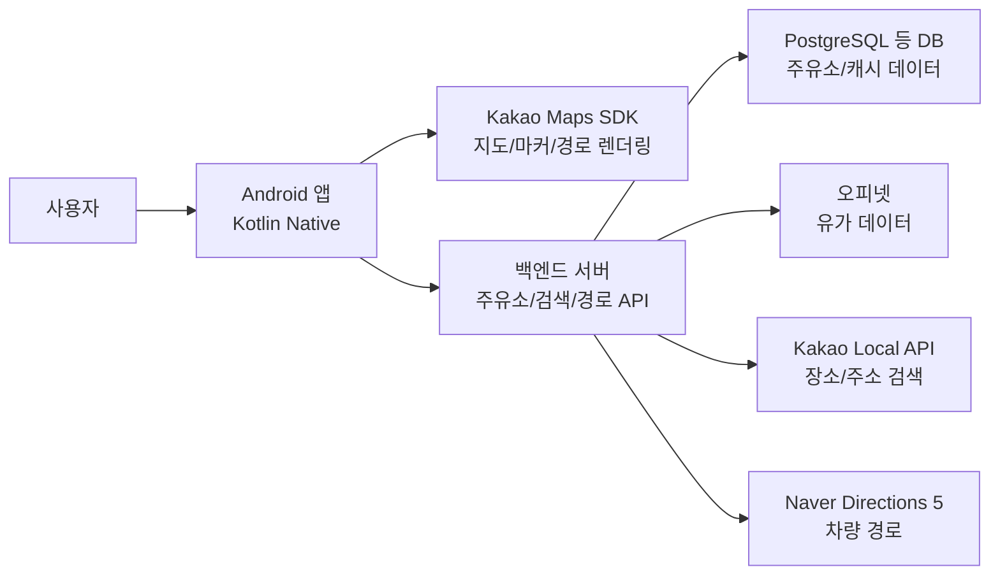
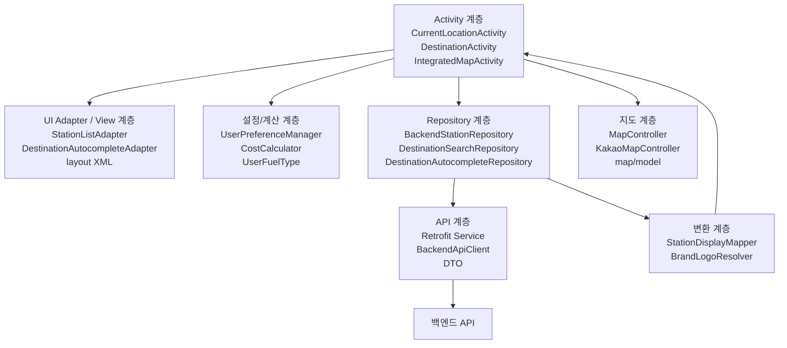
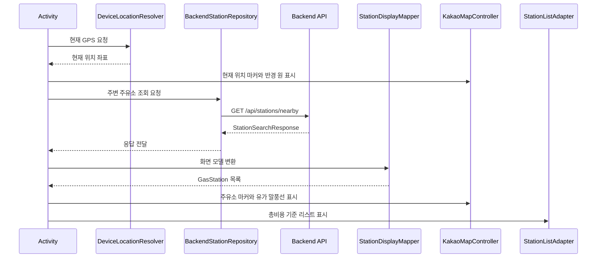
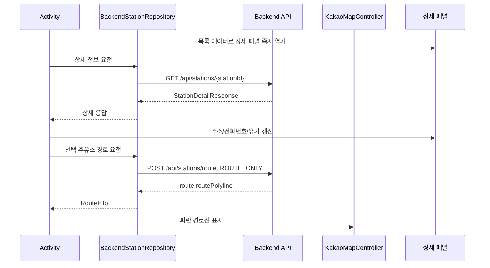
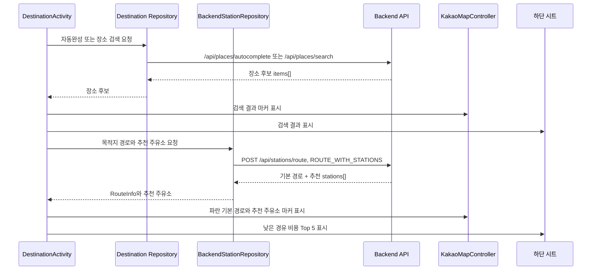

# CheapestOilFinder

CheapestOilFinder는 현재 위치 또는 목적지를 기준으로 주유소를 찾고, 유가와 이동 비용을 함께 비교하기 위한 Android 앱입니다.

Android 프론트엔드는 Kakao Maps SDK로 지도와 오버레이를 표시하고, 별도 백엔드 서버에서 주유소 위치, 브랜드, 유가, 상세 정보, 경로 정보를 받습니다. 오피넷, 카카오 Local API, 네이버 Directions 5 같은 외부 API는 프론트엔드가 직접 호출하지 않고 백엔드가 담당하는 구조를 지향합니다.

## 핵심 흐름

1. 앱은 위치 권한을 확인하고 GPS 좌표를 읽습니다.
2. 현재 위치 주변 주유소를 백엔드에서 받아 지도 마커와 하단 리스트로 표시합니다.
3. 사용자는 임시 유종과 검색 반경을 바꿔 주변 주유소 결과를 다시 계산하거나 재조회할 수 있습니다.
4. 주유소를 선택하면 상세 패널을 열고, 현재 위치에서 해당 주유소까지의 경로를 지도에 표시합니다.
5. 목적지를 검색하면 검색 결과를 지도와 하단 시트에 표시하고, 목적지를 확정하면 현위치-목적지 경로와 경로 주변 추천 주유소 Top 5를 표시합니다.
6. 추천 주유소를 선택하면 기존 목적지 경로와 주유소 경유 경로를 함께 보여줘 경유로 증가하는 이동거리를 비교합니다.

## 현재 구현 상태

### 구현됨

- Kotlin 기반 Android Native 앱
- 통합 지도 기본 화면, 레거시 메인, 현재 위치 기준 찾기, 목적지 기준 찾기, 설정 화면
- 앱 시작 시 위치 권한 확인 및 요청
- Kakao Maps SDK v2 지도 표시
- 현재 위치 GPS 자동 수신, GPS 재수신 버튼, 파란색 현재 위치 마커
- 현재 위치 기준 선택 반경 원 표시
- `3km / 5km / 10km` 주변 주유소 반경 선택
- Retrofit 기반 백엔드 API 연동
- 주변 주유소 조회, 상세 조회, 경로 조회
- 브랜드 로고 기반 주유소 마커와 유가 말풍선
- 브랜드 로고가 없는 주유소의 `⛽` 문자 마커 fallback
- 선택 유종 가격이 없거나 0원인 주유소의 지도/리스트 제외
- 설정 화면의 유종, 차량 연비, 1회 주유량 저장
- SharedPreferences 기반 사용자 설정 로드
- 이동비용, 예상 주유비, 예상 총비용 계산
- 예상 총비용 기준 주유소 리스트 정렬
- 주유소 리스트의 `최소화 / 절반 / 전체` 3단계 하단 패널
- 주유소 상세 패널의 `최소화 / 절반 / 전체` 3단계 하단 패널
- 주유소 상세 패널 닫힘 시 선택 주유소와 해당 경로 해제
- 현재 위치-선택 주유소 경로 표시
- 목적지 검색 전체화면 오버레이, 자동완성, 확정 검색
- 지도 상단 검색바 옆 설정 버튼과 전체화면 설정 오버레이
- 검색 결과 하단 시트와 검색 결과 지도 마커
- 목적지 확정 후 현위치-목적지 경로 표시
- 목적지 경로 주변 추천 주유소 Top 5 표시
- 추천 주유소 경유 경로와 추가 이동거리 라벨 표시
- 목적지 경로 요청 중 중앙 로딩 오버레이
- 앱 기본 진입 화면인 통합 지도의 주변 주유소 조회, 목적지 검색, 경로 추천 흐름

### 남은 작업 후보

- 통합 화면 디자인 개선
- 현재 위치 화면, 목적지 화면, 통합 화면에 중복된 패널/비용/지도 상태 로직 공통화
- 차량 접근이 어려운 목적지의 경로 실패 원인 분리 및 백엔드 보정 전략 확정
- 외부 내비게이션 앱 연동
- 릴리즈 빌드와 운영용 키 주입 정책 재점검

## 시스템 구조

CheapestOilFinder는 Android 앱이 직접 외부 유가·지도·길찾기 API를 조합하지 않고, 백엔드 서버를 통해 정규화된 데이터를 받아 화면에 표시하는 구조입니다. 프론트엔드는 사용자 입력, 위치 권한, 지도 렌더링, 비용 계산, 하단 패널 상태 관리에 집중합니다.



### 책임 분리

| 영역 | 담당 |
| --- | --- |
| Android 프론트엔드 | 화면 전환, 위치 권한, GPS 수신, 지도 오버레이, 리스트/패널 UI, 사용자 설정 저장, 비용 계산 |
| 백엔드 서버 | 주유소 조회, 상세 조회, 목적지 자동완성/검색, 네이버 Directions 기반 경로 조회, 경로 주변 추천 주유소 계산 |
| Kakao Maps SDK | 지도 표시, 카메라 이동, 라벨/마커, 원형 반경, 경로선 렌더링 |
| 외부 API | 오피넷 유가 데이터, 카카오 Local 장소 검색, 네이버 Directions 차량 경로 |
| 로컬 저장소 | SharedPreferences 기반 사용자 설정, Gradle 빌드 시 주입되는 로컬 비밀정보 |

## 프론트엔드 계층 구조

Android 앱 내부는 대략 `Activity -> Repository -> DTO/Mapper -> MapController/Adapter` 흐름으로 나뉩니다. 아직 실험 화면과 기존 화면이 공존하므로 일부 로직은 중복되어 있지만, 새 기능은 이 계층 방향을 유지하는 것을 목표로 합니다.



### Activity 계층

- `IntegratedMapActivity`는 앱의 기본 런처 화면이며 현재 위치 탐색과 목적지 탐색을 하나의 지도에서 처리합니다.
- `MainActivity`는 기존 분리 화면으로 들어갈 수 있는 레거시 메뉴 화면으로 유지합니다.
- `CurrentLocationActivity`는 현재 위치 기준 주변 주유소 조회, 리스트, 상세 패널, 현위치-주유소 경로를 담당합니다.
- `DestinationActivity`는 목적지 검색, 검색 결과 시트, 목적지 확정, 현위치-목적지 경로, 경로 주변 추천 주유소를 담당합니다.

Activity는 앱의 흐름과 상태를 조율하는 역할을 맡고, API 세부 호출이나 Kakao SDK 직접 조작은 가급적 Repository와 MapController에 맡깁니다.

### Repository와 API 계층

- `BackendStationRepository`는 주변 주유소, 상세 정보, 경로 및 추천 주유소 API 호출을 감쌉니다.
- `BackendDestinationAutocompleteRepository`와 `BackendDestinationSearchRepository`는 목적지 자동완성·검색 API 호출을 담당합니다.
- `BackendApiClient`와 `DestinationApiClient`는 Retrofit 인스턴스와 백엔드 기본 URL 구성을 담당합니다.
- `StationApiService`와 목적지 API service는 실제 HTTP endpoint 정의를 담습니다.
- `station/dto`와 `destination/api` 패키지는 백엔드 요청·응답 JSON 구조를 Kotlin 타입으로 표현합니다.

### 변환과 화면 모델 계층

- `StationDisplayMapper`는 백엔드 주유소 응답을 지도와 리스트에서 쓰기 좋은 모델로 변환합니다.
- `BrandLogoResolver`는 주유소 브랜드 문자열을 앱 리소스의 로고 이미지 또는 fallback 아이콘으로 연결합니다.
- `map/model` 패키지의 `GasStation`, `LocationPoint`, `RouteInfo`, `StationCostSummary`는 Kakao SDK에 직접 종속되지 않는 화면용 모델입니다.
- 이 분리 덕분에 백엔드 DTO가 바뀌어도 지도 렌더링 계층 전체를 같이 바꾸지 않도록 관리할 수 있습니다.

### 지도 계층

- `MapController`는 Activity가 기대하는 지도 조작 인터페이스입니다.
- `KakaoMapController`는 Kakao Maps SDK v2의 실제 구현체이며 지도 초기화, 카메라 이동, 현재 위치 마커, 주유소 마커, 유가 말풍선, 반경 원, 경로선을 관리합니다.
- Activity는 “주유소 목록을 보여줘”, “이 경로를 그려줘” 같은 의도 중심 호출을 하고, SDK 객체 생성과 라벨 rank 계산 같은 세부 구현은 `KakaoMapController` 안에 모읍니다.

### 설정과 비용 계산 계층

- `UserPreferenceManager`는 SharedPreferences에 유종, 연비, 1회 주유량을 저장하고 로드합니다.
- `UserFuelType`은 앱에서 쓰는 사용자 유종 값을 관리합니다.
- `CostCalculator`는 이동비용, 예상 주유비, 예상 총비용 계산 함수를 제공합니다.
- Activity와 Adapter는 계산식을 직접 흩뿌리지 않고 계산 결과를 받아 UI에 표시하는 방향을 지향합니다.

## 주요 데이터 흐름

### 현재 위치 주변 주유소 탐색



### 주유소 선택과 상세 패널



### 목적지 검색과 추천 주유소



## 상태 관리 관점

앱은 현재 화면별로 Activity 내부 상태를 중심으로 동작합니다. 별도 ViewModel 계층은 아직 도입하지 않았고, 화면 상태가 커지면서 `CurrentLocationActivity`, `DestinationActivity`, `IntegratedMapActivity` 안에 패널 상태, 선택 주유소, 선택 목적지, 경로, 검색 결과 캐시가 함께 존재합니다.

현재 주요 상태는 다음과 같습니다.

| 상태 종류 | 예시 |
| --- | --- |
| 위치 상태 | 현재 GPS 좌표, 마지막 조회 좌표, 선택 반경 |
| 주유소 상태 | 주변 주유소 목록, 필터링된 목록, 선택 주유소, 추천 Top 5 |
| 목적지 상태 | 검색어, 자동완성 후보, 검색 결과, 선택 장소, 확정 목적지 |
| 경로 상태 | 현위치-주유소 경로, 현위치-목적지 경로, 주유소 경유 경로 |
| 패널 상태 | 주유소 리스트, 검색 결과, 낮은 경유 비용, 주유소 상세 패널의 `MINIMIZED / COLLAPSED / EXPANDED / HIDDEN` |
| 사용자 설정 | 저장 유종, 임시 유종, 연비, 1회 주유량 |

향후 통합 화면을 기본 화면으로 전환하려면 Activity 내부 상태를 공통 패널 컨트롤러, 공통 지도 상태 관리자, 공통 비용 표시 모델로 분리하는 것이 좋습니다.

## 화면별 동작

### 앱 시작과 레거시 메인 화면

- 앱 아이콘을 누르면 `IntegratedMapActivity` 통합 지도 화면으로 바로 진입합니다.
- 기존 `MainActivity`는 `통합 지도에서 찾기`, `현재 위치 기준 찾기`, `목적지 기준 찾기`, `설정` 화면으로 이동하는 레거시 메뉴 화면으로 유지합니다.
- 위치 권한은 통합 지도 화면 진입 후 GPS 수신 흐름에서 확인하고, 권한이 없으면 요청합니다.
- 화면을 닫을 수 있는 상태에서 뒤로가기를 누르면 먼저 `종료하시려면 다시 뒤로가기를 눌러주세요.` 안내를 띄우고, 2초 안에 다시 뒤로가기를 눌렀을 때만 종료합니다.

### 현재 위치 기준 찾기

- 화면 진입 시 GPS를 읽고 주변 주유소를 자동 조회합니다.
- 현재 위치 마커와 선택 반경 원을 지도에 표시합니다.
- 주변 조회 반경은 `3km / 5km / 10km` 중 선택하며 기본값은 `5km`입니다.
- 리스트의 임시 유종 드롭다운은 설정값을 바꾸지 않고 현재 화면의 계산 기준만 바꿉니다.
- 유종이나 반경을 바꾸면 기존 선택 주유소 경로를 지우고 결과를 다시 계산하거나 재조회합니다.
- GPS 버튼은 누르는 즉시 저장된 현재 위치로 줌 15를 맞추고, 새 위치를 받으면 다시 중심을 맞춥니다.
- 이전 좌표와 새 좌표가 10m 미만 차이면 백엔드 주변 주유소 재요청은 생략합니다.
- `+`와 `-` 버튼은 `11 / 12 / 13 / 15` 줌 프리셋 사이를 이동합니다.
- 손가락 핀치는 프리셋과 무관하게 자유롭게 확대·축소할 수 있습니다.
- 주유소를 선택하면 상세 패널을 열고 `ROUTE_ONLY`로 현재 위치-주유소 경로를 요청합니다.
- 현재 위치 화면의 선택 주유소 경로는 파란색으로 표시하고, 상세 패널을 고려해 경로가 화면 상단 기준 약 25% 지점에 오도록 카메라를 맞춥니다.

### 목적지 기준 찾기

- 화면 진입 시 GPS를 자동 수신하고 현재 위치 마커로 먼저 맞춥니다.
- 상단 검색바는 뒤로가기 버튼 옆에 배치되어 있습니다.
- 상단 검색바 오른쪽에는 `⚙️` 설정 버튼이 있으며, 누르면 유종, 차량 연비, 1회 주유량을 조정하는 전체화면 설정 오버레이가 가장 높은 우선순위로 열립니다.
- 설정 오버레이에서 뒤로가기를 누르면 설정 오버레이만 닫고 이전 지도, 검색 결과, 경로, 패널 상태로 돌아갑니다.
- 검색바를 누르면 전체화면 검색 오버레이가 열리고 입력창에 포커스와 키보드가 자동으로 뜹니다.
- 검색창 입력이 1초 동안 멈추면 백엔드 `GET /api/places/autocomplete?query=...`로 자동완성 후보를 요청합니다.
- 자동완성 후보는 3~4개 정도 표시하고, 후보를 누르면 검색창 문구가 채워집니다.
- 검색 버튼 또는 키보드 검색키는 백엔드 `POST /api/places/search`를 호출합니다.
- 검색 결과는 오버레이가 닫힌 뒤 하단 검색 결과 시트와 지도 마커로 표시합니다.
- 검색 결과 시트는 `최소화 / 절반 / 전체` 상태를 지원합니다.
- 기본 검색 결과 마커는 빨간 점이고, 선택된 장소만 빨간 `📍` 핀으로 표시합니다.
- 리스트 항목 선택은 선택 장소를 화면 상단 기준 약 25% 위치에 맞추고 줌 15로 확대합니다.
- 지도 마커 선택은 카메라를 움직이지 않고 선택 마커만 변경합니다.
- 장소를 선택하면 `목적지로 설정` 버튼이 나타납니다.
- 목적지 확정 시 백엔드 `POST /api/stations/route`를 `ROUTE_WITH_STATIONS`로 호출합니다.
- 현위치-목적지 기본 경로는 파란색으로 표시하고, 경로가 화면 중앙에 오도록 카메라를 맞춥니다.
- 목적지 확정 후 검색 결과 마커와 검색 결과 시트는 숨기고, 목적지 마커와 추천 주유소 Top 5를 표시합니다.
- 추천 주유소를 선택하면 기본 경로 아래에 주황색 현위치-주유소-목적지 경유 경로를 표시합니다.
- 낮은 경유 비용 시트에서 추천 주유소를 선택하면 시트는 `최소화` 상태로 접히고, 인근 주유소와 같은 하단 상세 패널을 열어 주유소 정보를 표시합니다.
- 경유 추가거리 라벨은 `+#m` 또는 `+#km` 형식으로 표시합니다.
- 목적지 확정 상태에서 뒤로가기를 누르면 경로와 목적지 마커를 해제하고 확정 직전 검색 결과 상태로 돌아갑니다.

### 통합 지도 화면

- `IntegratedMapActivity`에서 관리하는 앱 기본 진입 화면입니다.
- 기존 `DestinationActivity`를 상속해 목적지 검색, 검색 결과 시트, 목적지 확정, 추천 주유소 흐름을 재사용합니다.
- 화면 진입 시 GPS를 읽고 현재 위치 기준 주변 주유소를 자동 조회합니다.
- 첫 주변 조회 성공 후 주변 주유소 리스트는 `최소화` 상태로 시작합니다.
- 주변 주유소 리스트에는 저장되지 않는 임시 유종 드롭다운과 `3km / 5km / 10km` 반경 드롭다운이 있습니다.
- 주변 주유소 마커나 리스트 항목을 누르면 현재 위치 화면과 같은 하단 상세 패널을 열고 현위치-주유소 경로를 표시합니다.
- 주변 주유소를 선택해 상세 패널을 열면 주변 주유소 리스트는 `최소화` 상태로 접힙니다.
- 주변 주유소 상세 패널이 열려 있어도 패널이 덮지 않는 지도 영역은 계속 터치, 이동, 확대·축소할 수 있습니다.
- 주변 주유소 상세 패널이 열려 있는 동안에는 상단 검색바만 화면 위로 올라가 사라지고, 뒤로가기 버튼은 기존 위치에 남습니다.
- 상세 패널이 닫히면 검색바가 다시 기존 위치로 내려옵니다.
- 주변 주유소 상세 패널의 `외부 지도앱으로 보기` 버튼은 선택 주유소 좌표와 이름을 Android 표준 지도 Intent로 넘겨 설치된 지도앱에서 해당 위치를 엽니다.
- 상세 패널의 `☎️` 버튼은 선택 주유소 전화번호를 Android 전화 앱에 넘깁니다.
- 전화번호가 없거나 더미 값이면 전화번호는 `-`로 표시하고, `☎️` 버튼은 회색 비활성 상태로 둡니다.
- 검색바를 눌러 목적지 검색을 시작하면 주변 주유소 마커, 유가 말풍선, 현재 위치 기준 반경 원을 지우고 목적지 검색 모드로 전환합니다.
- 상단 `⚙️` 설정 버튼은 같은 화면 안의 전체화면 설정 오버레이를 열며, 저장한 설정은 다음 비용 계산부터 SharedPreferences를 통해 반영됩니다.
- 검색 오버레이를 검색 실행 없이 닫으면 현재 GPS 좌표와 선택 반경 기준으로 주변 주유소를 다시 요청해 주변 주유소 마커와 리스트를 복구합니다.
- 목적지 검색 결과 시트를 뒤로가기로 완전히 닫아 첫 지도 상태로 돌아오면 현재 GPS 좌표와 선택 반경 기준으로 주변 주유소를 다시 요청합니다.
- 목적지를 확정하면 현위치-목적지 경로, 경로 주변 추천 주유소, 낮은 경유 비용 시트를 표시합니다.
- GPS 버튼과 `+`/`-` 버튼은 주변 주유소 리스트, 검색 결과 시트, 낮은 경유 비용 시트가 `최소화` 또는 `절반` 상태일 때 손잡이 위로 함께 이동하고, `전체` 상태에서는 시트 뒤에 자연스럽게 가려집니다.

### 설정 화면

- 사용자는 유종, 차량 연비, 1회 주유량을 저장할 수 있습니다.
- 목적지 기준 찾기와 통합 지도 화면에서는 상단 `⚙️` 버튼으로 별도 Activity 전환 없이 전체화면 설정 오버레이를 열 수 있습니다.
- 유종 선택지는 고급휘발유, 보통휘발유, 경유 3개입니다.
- 기본값은 `GAS_LOW`, `12.0km/L`, `30.0L`입니다.
- 연비와 1회 주유량은 0보다 커야 하며, 잘못된 값은 Toast 또는 입력창 에러로 안내합니다.
- 저장값은 `UserPreferenceManager`를 통해 SharedPreferences에 기록합니다.

## 하단 패널 상태

앱의 주요 하단 시트는 `최소화 / 절반 / 전체` 3단계 사용자 상태를 따릅니다.

| 상태 | 의미 |
| --- | --- |
| `최소화` | 화면 하단에 도크되어 손잡이와 헤더 일부가 보이는 상태 |
| `절반` | 화면 하단 절반 높이를 차지하는 상태 |
| `전체` | 화면 전체를 덮는 상태 |

내부 코드의 `HIDDEN`은 데이터가 아직 없거나 패널을 표시하지 않는 내부 상태이며, 사용자가 조작하는 3단계에는 포함하지 않습니다.

패널, 검색 오버레이, 목적지 확정 상태처럼 화면 안에서 되돌릴 UI 상태가 남아 있으면 뒤로가기는 해당 상태를 먼저 한 단계 되돌립니다. 더 이상 되돌릴 UI 상태가 없어서 화면이 닫힐 수 있는 시점에는 두 번 뒤로가기 종료 확인을 적용합니다.

### 주유소 리스트

- 첫 주변 주유소 조회 성공 후 `최소화` 상태로 시작합니다.
- 손잡이 영역에서만 확장·축소 제스처를 받습니다.
- 리스트 본문은 항목 선택과 세로 스크롤만 담당합니다.
- `최소화`와 `절반` 상태에서는 지도 터치를 가로채지 않아야 합니다.
- `전체` 상태에서 주유소 항목을 선택하면 리스트를 `절반` 상태로 접고 상세 패널을 엽니다.

### 검색 결과 시트

- 검색 확정 결과가 있으면 검색 오버레이를 닫고 검색 결과 시트를 표시합니다.
- 검색 결과 시트도 손잡이 영역으로 `최소화 / 절반 / 전체` 상태를 오갑니다.
- `전체` 상태에서 리스트 항목을 선택하면 `절반` 상태로 접어 지도와 선택 마커를 보여줍니다.

### 낮은 경유 비용 시트

- 목적지 경로 주변 추천 주유소 Top 5를 표시합니다.
- 주유소 리스트와 같은 `최소화 / 절반 / 전체` 상태를 사용합니다.
- 추천 주유소를 선택하면 경유 경로와 추가 이동거리 라벨을 지도에 표시합니다.

### 주유소 정보 패널

- 주유소 마커나 리스트 항목을 선택하면 `절반` 상태로 열립니다.
- 위로 스와이프하면 `최소화 -> 절반 -> 전체`, 아래로 스와이프하면 `전체 -> 절반 -> 최소화` 순서로 전환합니다.
- 뒤로가기는 아래로 스와이프와 같은 의미로 처리하며 `전체 -> 절반 -> 최소화 -> 숨김` 순서로 동작합니다.
- 정보 패널이 완전히 닫히면 선택 주유소와 해당 주유소 경로선을 함께 해제합니다.
- 통합 지도 화면에서는 정보 패널이 보이는 동안 상단 검색바만 숨기고 뒤로가기 버튼은 고정합니다.
- 통합 지도 화면에서는 정보 패널 외부 투명 스크림이 지도 조작을 가로채지 않아야 합니다.
- 정보 패널이 완전히 닫힌 뒤 검색바를 다시 표시합니다.
- 통합 지도 화면의 정보 패널에는 외부 지도앱으로 선택 주유소 위치를 여는 버튼과 전화 앱으로 주유소 전화번호를 넘기는 버튼이 있습니다.
- 전화번호가 비어 있거나 더미 값이면 `-`만 표시하고 전화 버튼은 비활성화합니다.
- 배경 지도는 어둡게 만들지 않습니다.

## 비용 계산

사용자 설정과 선택 유종 가격을 바탕으로 비용을 계산합니다.

| 항목 | 계산식 |
| --- | --- |
| 이동비용 | `(주유소까지의 이동거리_km / 차량연비_km_per_l) * 선택유종_리터당가격 * 2` |
| 예상 주유비 | `선택유종_리터당가격 * 1회주유량_L` |
| 예상 총비용 | `이동비용 + 예상 주유비 - discountAmount` |

- `discountAmount`는 현재 기본값 0입니다.
- 거리 값이 meter 단위로 오면 km로 변환합니다.
- 해당 유종 가격이 `null`이거나 0 이하이면 계산 대상에서 제외하거나 가격 없음으로 표시합니다.
- 목적지 추천 주유소가 기존 경로 위에 있어 경유 추가거리가 0m인 경우도 유효한 거리로 처리합니다.
- 0m 경유는 이동비용 0원과 예상 주유비만으로 총비용을 계산합니다.
- 거리 값이 없으면 더미 값을 넣지 않고 계산 불가 상태로 둡니다.

## 지도 마커와 경로 표시

- 현재 위치 마커는 파란색 점으로 표시하며 주유소 레이어보다 위에 둡니다.
- 현재 위치 선택 반경 원은 지도 바로 위, 모든 주유소 마커보다 아래에 둡니다.
- 주유소 마커는 브랜드별 짧은 투명 PNG 로고를 흰색 원 배경 위에 중앙 정렬해 표시합니다.
- 브랜드 로고가 없는 주유소는 새 이미지를 만들지 않고 흰색 원 배경 위의 `⛽` 문자 아이콘으로 표시합니다.
- 선택된 주유소 마커는 흰색 원 배경에 테두리를 표시합니다.
- 인근 주유소 선택은 파란색 테두리, 목적지 경로 추천 주유소 선택은 주황색 테두리를 사용합니다.
- 유가 말풍선은 선택 유종 가격을 우선 표시합니다.
- 유가 말풍선은 보통휘발유 `휘`, 고급휘발유 `고`, 경유 `경` 약어를 사용하고 `원/L`은 생략합니다.
- 지도 위 유가 말풍선은 렌더링 안정성을 위해 최대 80개까지만 표시합니다.
- 주유소 마커와 유가 말풍선은 카메라 이동 후 화면 좌표 기준으로 위에서 아래 순서로 정렬합니다.
- 아래쪽 항목에 더 높은 Kakao Label rank를 부여해 자연스럽게 위에 그려지도록 합니다.
- 말풍선은 해당 주유소 마커보다 아주 살짝 높은 우선순위를 갖습니다.
- 현재 위치-주유소 경로와 현위치-목적지 기본 경로는 파란색입니다.
- 목적지 추천 주유소 경유 경로는 주황색입니다.
- 경로 선은 기본 선보다 1.2배 두껍게 표시합니다.
- 백엔드 응답의 `route.routePolyline`이 비어 있으면 현재는 출발지-도착지 직선 fallback을 표시합니다.

## 백엔드 API

프론트엔드는 외부 API를 직접 호출하지 않고 백엔드 API를 호출합니다. API 계약과 호출 예시는 [docs/FRONTEND_BACKEND_API_GUIDE.md](docs/FRONTEND_BACKEND_API_GUIDE.md)에서 관리합니다.

| 기능 | API |
| --- | --- |
| 주변 주유소 조회 | `GET /api/stations/nearby` |
| 주유소 상세 조회 | `GET /api/stations/{stationId}` |
| 경로 및 추천 주유소 조회 | `POST /api/stations/route` |
| 목적지 자동완성 | `GET /api/places/autocomplete?query=...` |
| 목적지 확정 검색 | `POST /api/places/search` |

### 주변 주유소 조회

```text
GPS 위치
  -> NearbyStationSearchRequest
  -> GET /api/stations/nearby
  -> StationSearchResponse.items[]
  -> StationDisplayMapper
  -> KakaoMapController.showStations(...)
  -> StationListAdapter
```

- 요청에는 현재 위치, 선택 반경, 조회 유종 목록을 포함합니다.
- 프론트는 백엔드 응답을 받은 뒤 현재 위치 기준 직선거리로 반경 밖 주유소를 한 번 더 필터링합니다.
- 위도·경도 범위를 벗어난 비정상 좌표는 렌더링 전에 제외합니다.

### 주유소 상세 조회

```text
지도 마커 또는 리스트 항목 선택
  -> GET /api/stations/{stationId}
  -> StationDetailResponse
  -> 기존 목록 데이터와 병합
  -> 상세 패널 갱신
```

- 선택 직후에는 이미 받은 목록 데이터로 상세 패널을 먼저 엽니다.
- 상세 API가 성공하면 상호명, 브랜드, 주소, 전화번호, 유가를 응답값으로 갱신합니다.
- 상세 응답에 값이 없으면 목록 데이터나 임시 안내 문구를 유지합니다.

### 경로 조회

```text
현재 위치 + 목적지 또는 주유소
  -> RouteStationSearchRequest
  -> POST /api/stations/route
  -> StationSearchResponse.route
  -> KakaoMapController.showRoute(...)
```

- 현재 위치 기반 주유소 선택은 `ROUTE_ONLY`로 주유소까지의 경로만 요청합니다.
- 목적지 확정은 `ROUTE_WITH_STATIONS`로 현위치-목적지 기본 경로와 추천 주유소 Top 5를 함께 요청합니다.
- 추천 주유소의 `detourRoute.routePolyline`은 사용자가 해당 추천을 선택했을 때 경유 경로선으로 표시합니다.
- `routeExtraDistanceMeters`가 있으면 추가 이동거리 라벨에 우선 사용하고, 없으면 `detourRoute.distanceMeters - route.distanceMeters`로 보강합니다.

## 목적지 검색 설계

- 자동완성과 확정 검색은 분리합니다.
- 입력 중 자동완성은 백엔드 로컬 데이터 후보를 우선 사용합니다.
- 카카오 Local API 호출은 사용자가 검색을 확정했을 때 백엔드에서 수행합니다.
- 백엔드는 외부 호출 결과를 캐시해 같은 요청을 반복 호출하지 않는 방향을 권장합니다.
- 프론트는 백엔드 응답의 `items[]`를 우선 파싱합니다.
- Kakao 원본 호환을 위해 `x/y`, `documents`, `results`, `places` 배열도 방어적으로 처리합니다.
- 자동완성 후보가 없거나 호출이 실패하면 로컬 플레이스홀더 후보로 보강합니다.

## 통합 지도 화면 운영 계획

통합 지도 화면은 현재 위치 주변 탐색과 목적지 기반 탐색을 한 지도에서 처리하는 앱의 기본 화면입니다.

### 현재 단계

- 앱 런처가 통합 지도 화면으로 바로 연결됩니다.
- 기존 메인 화면은 레거시 메뉴와 회귀 테스트용으로 유지합니다.
- 진입 시 주변 주유소를 자동 조회합니다.
- 주변 주유소 리스트에서 임시 유종과 반경을 바꿀 수 있습니다.
- 검색바로 목적지 검색 모드에 들어갈 수 있습니다.
- 목적지 확정 후 기본 경로와 추천 주유소를 표시합니다.

### 다음 단계 후보

- 통합 화면 디자인 개선
- 공통 패널 컨트롤러 분리
- 현재 위치 화면과 통합 화면의 비용 표시 로직 공통화
- 경로 실패 목적지의 좌표 보정 정책 확정

## 저장소 구조

```text
app/
  src/main/java/com/example/cheapestoilfinder/
    CheapOilApplication.kt       # 앱 시작과 Kakao Maps SDK 초기화
    entry/
      MainActivity.kt            # 레거시 메뉴 화면, 분리 화면 진입
      CurrentLocationActivity.kt # GPS, 주변 조회, 리스트, 상세 패널
      DestinationActivity.kt     # 목적지 검색, 경로, 추천 주유소
      IntegratedMapActivity.kt   # 앱 기본 런처, 현재 위치 주변 탐색과 목적지 검색 통합 화면
      StationListAdapter.kt      # 주유소 리스트 항목 렌더링
    location/
      DeviceLocationResolver.kt  # 기기 위치 조회
    map/
      KakaoMapConfig.kt          # BuildConfig의 Kakao 키 접근
      KakaoMapController.kt      # 지도, 카메라, 마커, 말풍선, 반경 원, 경로
      model/                     # 지도·화면 독립 모델
    recommendation/              # 추천 계산 확장 지점
    settings/                    # 차량 설정 화면과 SharedPreferences 저장소
    station/
      api/                       # Retrofit 서비스와 API 설정
      dto/                       # 백엔드 요청·응답 모델
      BackendStationRepository.kt
      StationDisplayMapper.kt
      BrandLogoResolver.kt
  src/main/res/
    layout/                      # 화면과 리스트 XML
    drawable-nodpi/              # 앱에서 사용하는 브랜드 PNG
    values/                      # 문자열, 색상, 테마
docs/
  FRONTEND_BACKEND_API_GUIDE.md # 백엔드 API 계약
  BACKEND_API_ACCESS_CLAIM.md   # 최신 백엔드 연동 이슈, 로컬 전용
logo/                           # 브랜드 로고 원본
secrets/                        # 로컬 비밀정보와 예제 안내
README.md
AGENTS.md
```

## 주요 파일 빠른 찾기

| 작업 | 먼저 확인할 파일 |
| --- | --- |
| 현재 위치 화면과 리스트 상태 | `CurrentLocationActivity.kt`, `activity_current_location.xml` |
| 목적지 검색과 경로 추천 | `DestinationActivity.kt`, `activity_destination.xml` |
| 통합 지도 화면 | `IntegratedMapActivity.kt`, `activity_destination.xml` |
| GPS 수신 | `DeviceLocationResolver.kt` |
| 지도 마커, 말풍선, 경로, 카메라 | `KakaoMapController.kt` |
| 주변·상세·경로 API 정의 | `StationApiService.kt` |
| Retrofit 호출과 오류 처리 | `BackendStationRepository.kt`, `BackendApiClient.kt` |
| 백엔드 DTO 변환 | `StationDisplayMapper.kt`, `station/dto/` |
| 사용자 설정과 비용 계산 | `UserPreferenceManager.kt`, `CostCalculator.kt`, `UserFuelType.kt` |
| 브랜드 로고 선택 | `BrandLogoResolver.kt`, `drawable-nodpi/` |
| API 키와 백엔드 주소 빌드 주입 | `app/build.gradle.kts`, `KakaoMapConfig.kt`, `BackendApiConfig.kt` |
| API 계약과 호출 예시 | `docs/FRONTEND_BACKEND_API_GUIDE.md` |
| 개발 규칙과 UI 상태 계약 | `AGENTS.md` |

## 로컬 설정과 비밀정보

실제 값은 다음 로컬 파일에 한 줄로 저장합니다.

```text
secrets/kakao_native_app_key.txt
secrets/backend_base_url.txt
```

- `kakao_native_app_key.txt`: Kakao 네이티브 앱 키
- `backend_base_url.txt`: 끝에 `/`가 포함된 백엔드 기본 URL
- 파일이 없으면 개발 기본 주소 `http://10.0.2.2:8080/`을 사용합니다.
- 실제 `secrets/*.txt`, `*.properties`, 서명키와 keystore는 `.gitignore`로 제외합니다.
- 실제 키나 URL 값을 README, AGENTS, 소스 코드, 로그에 복사하지 않습니다.
- release 빌드의 Kakao 앱 키는 빈 값으로 주입합니다.
- 설치된 Android 앱은 PC의 `secrets/` 폴더를 직접 읽을 수 없으므로, Cloudflare Tunnel 주소 변경 후에는 Android Studio Run 또는 install로 APK에 새 값을 반영해야 합니다.

실기기에서 로컬 백엔드를 사용할 때는 다음 중 하나를 사용합니다.

- 같은 Wi-Fi: `http://<개발 PC LAN IP>:8080/`
- USB: `adb reverse tcp:8080 tcp:8080` 후 `http://127.0.0.1:8080/`
- 외부 테스트: Cloudflare Tunnel HTTPS 주소

## 빌드

```powershell
.\gradlew.bat assembleDebug
.\gradlew.bat installDebug
.\gradlew.bat test
```

개발 환경은 Java 17, `compileSdk 35`, `minSdk 24`, `targetSdk 35`를 사용합니다.

## 개발 작업 규칙

- 작업 전에는 `README.md`와 `AGENTS.md`를 읽고 현재 구현 방향과 제약을 확인합니다.
- 기능 구현이나 사용자 동작을 변경하면 `README.md`를 함께 갱신합니다.
- 에이전트 규칙, 보안, 아키텍처 전제, UI 상태 계약이 바뀌면 `AGENTS.md`도 갱신합니다.
- 문서 끝에 “최근 규칙”을 계속 추가하지 않고, 같은 주제의 기존 설명을 찾아 교체하거나 통합합니다.
- 앱 코드는 Kotlin을 기본으로 작성합니다.
- 비밀 파일, 디버깅 이미지, UI dump, 로컬 백엔드 클레임 문서는 Git에 포함하지 않습니다.
- Kotlin 또는 Android 리소스를 수정하면 가능한 한 `.\gradlew.bat compileDebugKotlin`으로 검증합니다.
- 전체 작업 규칙의 정본은 `AGENTS.md`입니다.

### 커밋 메시지

변경 성격에 따라 다음 접두사를 사용합니다.

- 문서 위주: `docs:`
- 기능 구현 위주: `feat:`
- 버그 수정 위주: `fix:`

커밋 메시지는 제목 한 줄과 세부 bullet 두 개 이상으로 작성합니다.

```text
fix: 주유소 리스트 초기 최소화 상태 복구

- 첫 조회 성공 시 하단 도크 패널을 명시적으로 표시
- 리스트 3단계 상태 정의와 회귀 검증 문서 정리
```

## 알려진 제한

- Kakao Maps SDK 네이티브 라이브러리 때문에 일부 x86_64 에뮬레이터에서 실행이 실패할 수 있습니다.
- 주유소 상세 응답의 전화번호가 비어 있으면 임시 문구를 표시합니다.
- 백엔드 경로 응답의 `route.routePolyline`이 비어 있으면 현재는 출발지-도착지 직선 fallback을 표시합니다.
- 차량 접근이 어려운 목적지에서는 백엔드 Directions 경로 요청이 실패할 수 있으며, 도로 접근 가능 지점 보정 정책이 필요합니다.
